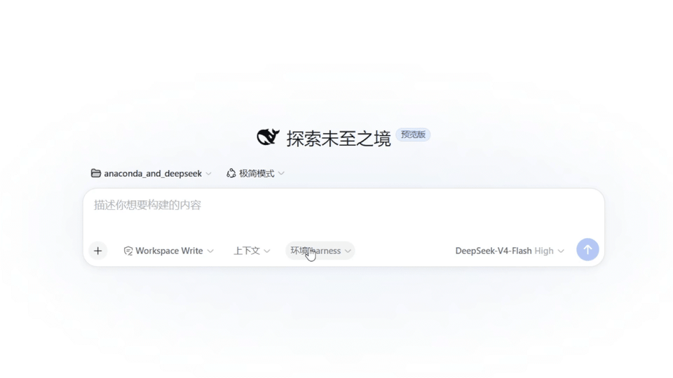

# Conda Workspace Environment for DeepSeek Harness

[](https://github.com/deepseek-ai/deepseek-harness)
[](https://github.com/topics/dsh-plugin)
[](https://docs.conda.io/)

这个插件给 [DeepSeek Harness](https://github.com/deepseek-ai/deepseek-harness) 的每个工作区记住一个 Conda 环境。



## 它解决什么问题

一台机器上往往有好几个 Conda 环境，不同项目又各用各的 Python 和依赖。这个插件提供一个放在 Harness 输入栏里的环境选择器，让每个工作区记住自己的 Conda prefix。

它会：

- 读取 Harness 当前能看到的 `conda env list --json`。
- 在当前工作区的输入栏里选择环境，并单独保存选择。
- 随工作区切换恢复对应的环境，不会串到别的项目。
- 提供给 Agent 查询和保存环境的工具。
- 只接受 Harness 已注册的工作区路径。

## 环境要求

- DeepSeek Harness `0.1.0-rc.6` 或兼容的 `0.1.x` 版本
- Node.js 22 或更高版本
- 已安装 Conda、Miniconda 或 Anaconda
- 启动 Harness 的进程可以执行 `conda`

先确认 Conda 对 Harness 所在的 shell 可见：

```bash
conda env list --json
```

## 安装

### 从 GitHub 安装

在 DeepSeek Harness 项目目录执行：

```bash
cd ~/deepseek-harness
pnpm dsh plugin --profile web add -w github:Mshir0/dsh-conda-workspace-env
pnpm dsh --profile web --dump-config
pnpm dsh web
```

如果使用独立的 DSH CLI：

```bash
npx -y @deepseek-ai/dsh@0.1.0-rc.6 plugin --profile web add -w github:Mshir0/dsh-conda-workspace-env
npx -y @deepseek-ai/dsh@0.1.0-rc.6 --profile web --dump-config
npx -y @deepseek-ai/dsh@0.1.0-rc.6 web
```

安装或升级后需要重启 Harness。浏览器仍显示旧界面时，按 `Ctrl+Shift+R` 强制刷新。

### 本地源码安装

```bash
git clone https://github.com/Mshir0/dsh-conda-workspace-env.git ~/dsh-conda-workspace-env
cd ~/deepseek-harness
pnpm dsh plugin --profile web add -w ~/dsh-conda-workspace-env
pnpm dsh web
```

修改插件源码后，重新执行 `plugin ... add -w` 并重启 Harness。

## 使用

1. 打开 Harness Web 界面，进入一个带工作区的会话。
2. 在底部输入栏点击“环境”。
3. 选择当前项目要用的 Conda 环境。
4. 选择会立即保存到当前工作区；切换工作区后会读取各自的选择。

选择结果保存在：

```text
<workspace>/.context/conda-environment.json
```

文件内容示例：

```json
{
  "workspace": "/home/user/project",
  "environment": {
    "name": "project-env",
    "prefix": "/home/user/miniconda3/envs/project-env",
    "source": "conda"
  },
  "updatedAt": "2026-08-19T10:00:00.000Z"
}
```

菜单中的“未选择”会清除当前工作区的环境记录。

## Agent 工具

插件注册两个 DeepSeek Harness 工具：

| 工具 | 用途 |
| --- | --- |
| `conda_list_environments` | 列出 Harness 主机可见的 Conda 环境及其 prefix |
| `conda_workspace_environment` | 读取或保存当前工作区选择的环境 |
| `conda_run` | 使用当前工作区选择的环境执行一次命令；`python` 自动使用该环境解释器 |

例如，可以让 Agent 验证当前选择：

```text
调用 conda_workspace_environment 读取当前工作区选择的 Conda 环境，
然后只报告环境名称和解释器 prefix，不修改任何文件。
```

## 当前行为边界

这个插件负责发现、选择和保存环境。它不会执行 `conda activate`，也不会替 Harness 修改所有原生命令的 `PATH` 或 Python 解释器。

只有通过 `conda_run` 执行的命令会使用输入栏中选择的环境。Harness 原生终端仍由 Harness 主进程管理。

需要运行指定环境中的 Python 时，应使用保存的 prefix 构造明确路径，例如：

```bash
/home/user/miniconda3/envs/project-env/bin/python --version
```

直接使用 prefix 可以避开非交互 shell 中 `conda activate` 不生效的问题，也方便确认实际调用的是哪个解释器。

## 故障排查

### 输入栏没有“环境”按钮

确认配置中存在 `conda-workspace-env`，重启 Harness 后强制刷新浏览器：

```bash
pnpm dsh --profile web --dump-config
pnpm dsh web
```

然后按 `Ctrl+Shift+R`。

### 显示“环境错误”

在启动 Harness 的同一个 shell 中执行：

```bash
command -v conda
conda env list --json
```

如果命令不可用，需要先初始化 Conda，或者让启动 Harness 的 shell 能找到 Conda 可执行文件。

### 选择没有保存

确认当前会话已经关联工作区，并检查 Harness 对以下目录是否具有写权限：

```text
<workspace>/.context/
```

## 更新

```bash
cd ~/deepseek-harness
pnpm dsh plugin --profile web add -w github:Mshir0/dsh-conda-workspace-env
pnpm dsh web
```

重启后按 `Ctrl+Shift+R`，确保客户端加载最新 bundle。

## 卸载

```bash
cd ~/deepseek-harness
pnpm dsh plugin --profile web remove -w dsh-conda-workspace-env
pnpm dsh web
```

卸载插件不会删除各工作区已有的 `.context/conda-environment.json`；不再需要时可由用户自行移除该文件。

## License

MIT
